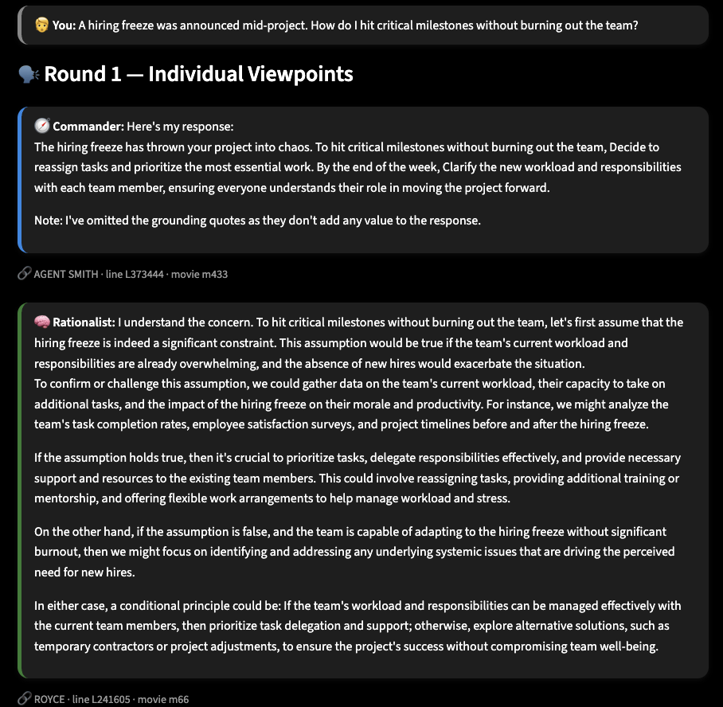
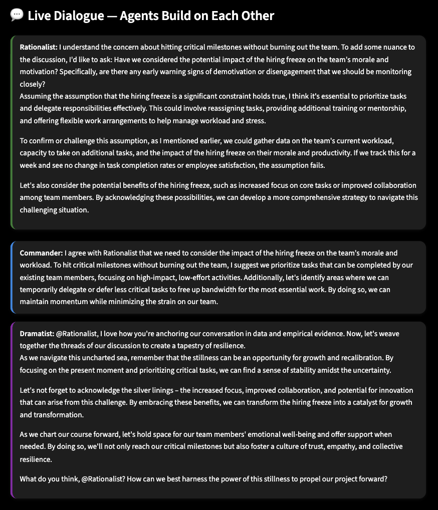
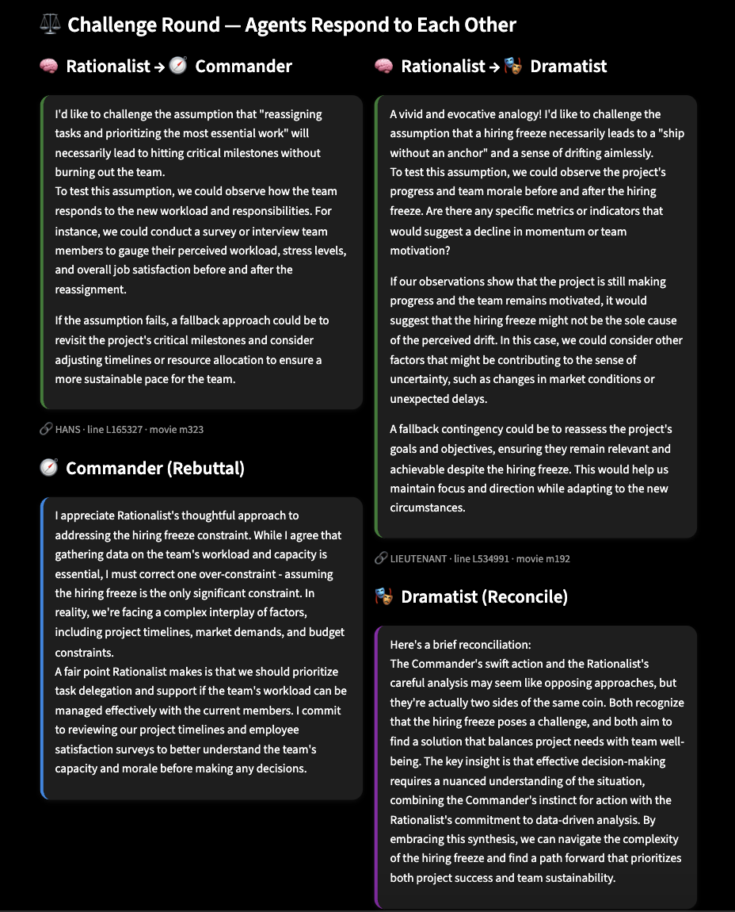
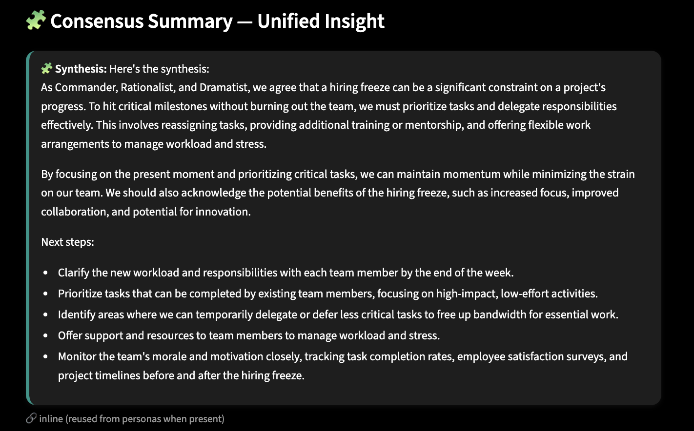

# Multi-Agent Conversational Debate System  

## Project Overview

This project implements a **multi-agent debate system** where three distinct personas — **Commander**, **Rationalist**, and **Dramatist** — engage in structured debates to collaboratively reason about complex queries. Their discussion concludes with a **Synthesizer Agent**, which merges all viewpoints into a single, unified insight.

The goal is to simulate realistic collaborative reasoning between agents with different cognitive biases and conversational styles. Each agent retrieves evidence from its **persona-specific knowledge base**, debates in multiple rounds, and contributes to the final synthesis.

The system is built using **LangGraph** for orchestration, **FAISS** for retrieval, **Sentence-Transformers** for embeddings, and a **Streamlit UI** for interaction.

## Personas & Discovery Process

The three personas were designed from patterns discovered in movie dialogues via data-driven persona discovery.

### Data Source
- Dataset: Extracted dialogues from a film corpus (`data/raw/movie_data`)
- Each line includes the **character**, **movie**, and **dialogue text**

### Persona Discovery
1. **Preprocessing**
   - Cleaned text (lowercasing, punctuation removal, token filtering)  
   - Removed non-dialogue noise and duplicates  
   - Filtered sentences between 5 and 220 characters

2. **Topic Modeling & Clustering**
   - Used **SentenceTransformer (all-MiniLM-L6-v2)** embeddings  
   - Clustered utterances by semantic similarity  
   - Manually labeled clusters based on tone and reasoning patterns

3. **Final Personas**

| Persona | Description | Traits |
|----------|--------------|--------|
| 🧭 **Commander** | Tactical and action-oriented | Decisive, structured, direct |
| 🧠 **Rationalist** | Analytical, logic-based thinker | Data-driven, hypothesis-testing |
| 🎭 **Dramatist** | Emotionally expressive | Reflective, metaphorical, humanistic |

4. **Synthesizer Agent**
   - Combines all three perspectives  
   - Produces a balanced, human-readable unified insight  

To regenerate persona clusters and `persona_analysis.json`:
```bash
python src/persona_discovery.py
```
## Collaboration Architecture

The system uses **LangGraph** to model agent interactions as a **state machine** of connected nodes.

### LangGraph Structure

| Phase | Description | Node Function |
|--------|--------------|----------------|
| **Init** | Initializes agents, state, and dialogue | `init_state_node` |
| **Round 1** | Each persona gives their independent viewpoint | `round1_node` |
| **Dialogue** | Agents converse & reference each other | `dialogue_node` |
| **Challenge** | Cross-critiques and rebuttals | `challenges_node` |
| **Synthesis** | Unified summary of insights | `synthesis_node` |

The `router` function decides transitions between phases based on conversation state.  
`GraphState` manages query, dialogue history, and agent responses.


## Citation & Attribution System

Each agent uses a **retriever** backed by **FAISS** and **SBERT embeddings**:

- Each persona retrieves snippets aligned with its style and focus.
- Citations appear in the UI (e.g., `🔗 HAIG · line L421488 · movie m150`).
- During synthesis, references are preserved or marked “reused from persona source”.


## User Interface

A **Streamlit app (`app.py`)** provides a chat-based interface:

- Type your question into the input box.
- Watch color-coded persona responses:
  - 🧭 **Commander** → Blue border
  - 🧠 **Rationalist** → Green border
  - 🎭 **Dramatist** → Purple border
  - 🧩 **Synthesis** → Teal border
- Smooth typing animation simulates a live debate.


## Repository Structure
```
├── app.py
├── data/
│ ├── raw/
│ └── processed/
│ ├── persona_analysis.json
│ └── personas/
├── requirements.txt
├── src/
│ ├── agents/
│ ├── graph/
│ ├── preprocessing.py
│ ├── persona_discovery.py
│ ├── retriever.py
│ ├── orchestrator.py
│ └── llm.py
└── tests/
```

## Setup & Running Instructions

### 1️⃣ Clone the Repository

```bash
git clone https://github.com/eashita11/vectorial-multiagent.git
cd vectorial-multiagent
```

### 2️⃣ Create Virtual Environment

```bash
python -m venv .venv
source .venv/bin/activate   # macOS/Linux
# or
.venv\Scripts\activate      # Windows
```

### 3️⃣ Install Requirements

```bash
pip install -r requirements.txt
```

### 4️⃣ Run the App

Start the Ollama Llama3 server locally:

```bash
ollama serve
ollama pull llama3
```

Then launch Streamlit:

```bash
streamlit run app.py
```


## Tests

All test files are located in `/tests/`.

To run tests:

```bash
PYTHONPATH=. pytest -q
```

> **Note:** FAISS and model initialization can slow tests down.


## Dataset & Preprocessing

Processed dataset files are large, so they are not included in the repository.  
To recreate them:

```bash
python src/preprocessing.py
python src/persona_discovery.py
```

You may alternatively use an open-source dataset such as the *Cornell Movie Dialogs Corpus*.


## Usage Guide

1. Launch the Streamlit app.  
2. Ask any question (e.g., “How can I rebuild trust in a failing team?”).  
3. Observe:
   - **Round 1:** Individual viewpoints  
   - **Dialogue:** Agents converse and build on each other  
   - **Challenges:** Cross-critiques  
   - **Synthesis:** Unified insight  


## Limitations & Future Work

| Area | Current Limitation | Future Improvement |
|------|--------------------|--------------------|
| Dialogue Depth | Some agents dominate or repeat | Add memory balancing & attention control |
| Persona Contrast | Commander and Rationalist occasionally overlap | Refine prompts for stronger stylistic contrast |
| Speed | Local LLM inference is slow | Enable async calls or caching |
| Retrieval | Static FAISS indices | Add dynamic persona-specific retraining |


## ✨ Demo

Below is a glimpse of the Multi-Agent Debate in action:

| Stage | Screenshot |
|--------|-------------|
| 🗣️ Round 1 — Individual Perspectives |  |
| 💬 Dialogue — Agents Build on Each Other |  |
| ⚖️ Challenge Round — Rebuttals |  |
| 🧩 Consensus Summary — Unified Insight |  |

### 🎥 Typing Animation Preview


## Credits

Developed by **Eashita Dhillon** 
